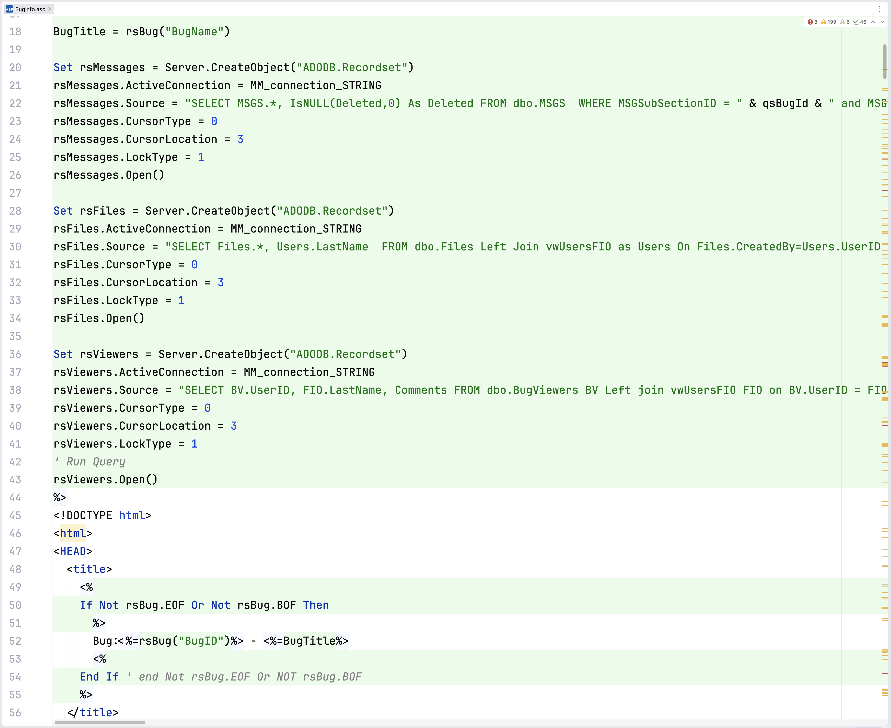

# ASP Classic Language Support for IntelliJ IDEA

An IntelliJ Platform plugin that adds support for **ASP Classic** files with **VBScript** engine (`.asp`, `.inc`).

Modern IDEs often lack proper support for legacy technologies like ASP Classic. 
This plugin aims to make the maintenance of legacy codebases more comfortable by providing essential IDE features within PHPStorm, IntelliJ IDEA, and other JetBrains tools.

## Current Status (MVP)

Currently, the plugin provides basic support for ASP files using the VBScript engine.

### What works now:
- **File Recognition**: Supports `.asp` and `.inc` files.
- **Language Injection**: Correctly identifies `<% ... %>` and `<%= ... %>` blocks.
- **Syntax Highlighting**: 
    - Basic VBScript syntax highlighting.
    - Special highlighting for variables (identifiers) to improve readability.
- **Multi-Host Injection**: Properly handles multiple scriptlet blocks as a single VBScript context.
- **Basic HTML Support**: HTML parts of the ASP files are handled by the IDE's built-in HTML support.
- **Basic Navigation**: "Jump to Definition" for local variables and functions within the same file (experimental).

### Visual Demonstration

*Support for syntax highlighting and scriptlet blocks.*

## Roadmap (Planned Features)
- [ ] **Go To Definition (Stable)**: Restore and stabilize local symbol navigation in ASP scriptlets and VBScript files.
- [ ] **Full Symbol Resolve**: Improved cross-file navigation and support for `Server.CreateObject`.
- [ ] **Code Completion**: Basic IntelliSense for VBScript and built-in ASP objects (`Request`, `Response`, `Session`, etc.).
- [ ] **Include Support**: Resolve files included via `<!-- #include ... -->`.
- [ ] **Formatters**: Basic code formatting for VBScript blocks.
- [ ] **Debugger**: Integration with Windows debugging tools (high complexity).

## Contributing

Contributions are very welcome! Since this is a niche tool for legacy technology, every bit of help counts.

If you want to help:
1. **Report bugs**: Open an issue if something isn't working as expected.
2. **Submit PRs**: If you know Kotlin and the IntelliJ SDK, feel free to pick up a task from the Roadmap.
3. **Suggestions**: Have an idea for a feature? Let's discuss it in the Issues.

### Development Note
This project uses Gradle. You can run the IDE with the plugin enabled using:
```bash
./gradlew runIde
```

## License
Distributed under the Apache License 2.0. See `LICENSE` for more information.

---
*Created by [Artem Selifonov (Dvamuch)](https://github.com/Dvamuch)*
